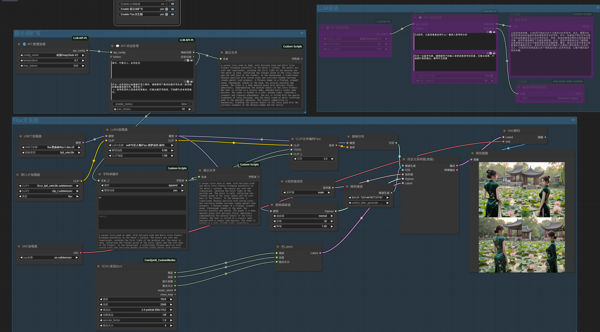

# ComfyUI-LLM-API-PL
LLM API for comfyui chat. DeepSeek (OpenAPI like Standard API).

本插件提供与LLM远程大语言模型API(DeepSeek等)的对接能力，支持提示词扩写、会话咨询等功能，以及对话历史管理。

## 功能特性

- 🌐 多API端点配置管理
- 📝 系统提示词预设（默认绘图提示词扩写）
- 🕒 可配置的对话历史管理
- 🔒 API密钥安全存储
- 🔄 支持连续对话上下文

## 安装说明

1. 安装依赖
```bash
git clone https://github.com/greengerong/ComfyUI-LLM-API-PL
pip install -r requirements.txt
```

2. 配置API信息
在插件目录创建`pl-config.json`：
```json
{
  "models": [
    {
      "name": "DeepSeek配置",
      "model": "deepseek-chat",
      "api_key": "your-api-key",
      "base_url": "https://api.deepseek.com"
    }
  ]
}
```
**重要**：DeepSeek官网会员经常服务器忙中断服务，建议使用硅基提供的满血版服务（可在线网页和API使用，注册即送14元可玩很长时间）：[硅基DeepSeek满血模型](https://cloud.siliconflow.cn/i/UiJMuo4o)

## 节点说明

### 🌐 API 配置加载
- **config_name**: 选择预配置的API方案
- **temperature**: 生成随机性 (0.0-1.0)
- **max_tokens**: 最大生成长度

### 💬 API 对话处理
- **system_prompt**: 系统角色提示词（默认绘图扩写）
- **user_prompt**: 用户输入提示词
- **enable_history**: 启用对话历史
- **max_history**: 最大历史记录数 (1-10)

## 工作流
参见`workflows`目录。


## 配置参数说明

| 参数          | 说明                  |
|-------------|---------------------|
| config_name | 自定义配置名称            |
| model       | API模型名称            |
| base_url    | API HOST地址            |
| api_key     | 认证密钥               |

**pl-config.json**
可以设置所有**OpenAI API标准协议**的LLM模型。如：DeepSeek、OpenAI、KIMI等。

```json
{
  "models": [
    {
      "name": "DeepSeek官方Chat API",
      "model": "deepseek-chat",
      "api_key": "your-api-key-here",
      "base_url": "https://api.deepseek.com"
    },
    {
      "name": "硅基DeepSeek-R1",
      "model": "deepseek-ai/DeepSeek-R1",
      "api_key": "your-api-key-here",
      "base_url": "https://api.siliconflow.cn/v1"
    },
    {
      "name": "硅基DeepSeek-V3",
      "model": "deepseek-ai/DeepSeek-V3",
      "api_key": "your-api-key-here",
      "base_url": "https://api.siliconflow.cn/v1"
    }
  ]
}
```
## 联系作者
